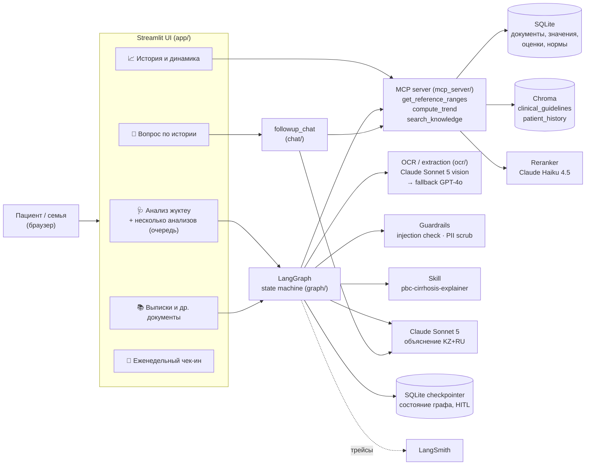
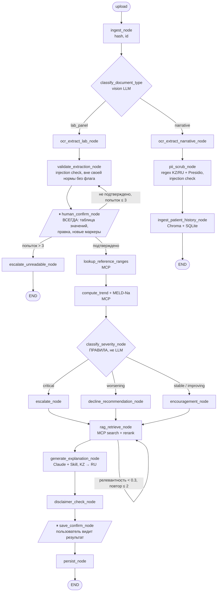

# MedAgent — архитектура

MedAgent — персональный ассистент для пациентки с первичным билиарным холангитом (ПБХ) и циррозом печени и её семьи. Он читает фото и PDF анализов и выписок, сохраняет историю, считает тренды и объясняет результаты простым языком **на казахском и русском**. Диагнозов он не ставит.

Главный принцип: **LLM делает то, что умеет (чтение документов, объяснение, поиск по смыслу), а всё, от чего зависит безопасность, решает детерминированный код или человек.**

---

## 1. Компоненты

| Компонент | Технология | Зачем |
|---|---|---|
| UI | Streamlit, 5 страниц, `st.navigation` с казахскими названиями | Требование ТЗ: веб-фронтенд. Основной пользователь — семья, не разработчик |
| Оркестрация | LangGraph + `SqliteSaver` | Ветвления, циклы, **два HITL-прерывания**; состояние переживает перезагрузку страницы (восстановление по `thread_id` из URL) |
| OCR | Claude Sonnet 5 (vision, нативный PDF) → fallback GPT-4o (PDF растрируется постранично) | Реальные казахстанские бланки: RU/KZ, несколько страниц, качественные результаты («отр», «1:80») |
| Инструменты | Собственный **MCP-сервер** (stdio), 3 tool | Типизированные схемы, независимое тестирование, отдельные шаги в трейсе |
| Знания | Chroma, **две коллекции**, эмбеддинги `text-embedding-3-small` | `clinical_guidelines` (14 документов: AASLD/EASL, протокол МЗ РК по ПБХ, …) и `patient_history` (свои выписки, УЗИ, FibroScan) |
| Реранкер | Claude Haiku 4.5 | Эмбеддинги поставили нужный фрагмент на 13-е место из 33 на реальном запросе |
| Skill | `skills/pbc-cirrhosis-explainer/` (SKILL.md, глоссарий KZ/RU, шаблоны тона) | Загружается **только** в узле объяснения (progressive disclosure) |
| Хранилище | SQLite (SQLAlchemy) | Документы, подтверждённые значения, оценки, журнал эскалаций, нормы |
| Наблюдаемость | LangSmith | Трейс каждого узла графа и каждого вызова Claude |

---

## 2. Граф (LangGraph)

Что есть в графе с точки зрения требований:
- **Ветвление**: тип документа; три тона по уровню тяжести (тон — отдельные узлы, чтобы ветка была видна в трейсе, а не пряталась в поле состояния).
- **Циклы**: повтор подтверждения (≤ 3), повтор RAG-поиска при низкой релевантности (≤ 2).
- **HITL**: `interrupt()` / `Command(resume=…)` — подтверждение значений **безусловно** и подтверждение сохранения.

---

## 3. Как проходит один запрос (загрузка анализа)

| # | Шаг | Кто | Время* |
|---|---|---|---|
| 1 | Файл → SHA-256; если такой файл уже есть в базе — предупреждение до любого вызова LLM | код | — |
| 2 | Определение типа: таблица анализа или текст | Claude vision | ~3 с |
| 3 | Извлечение значений в строгую схему `LabExtraction` (Pydantic): маркер, код, значение или `value_text`, единицы, **норма с бланка**, флаг, дата регистрации, лаборатория, название анализа | Claude Sonnet 5, при ошибке — GPT-4o | 7–30 с |
| 4 | Проверки: injection-паттерны во всех текстовых полях; «значение вне своей нормы, но без флага» (признак ошибки чтения); **тот же анализ уже сохранён из другого файла** | код | — |
| 5 | ⏸ Пользователь видит таблицу (🔴/🟢), дату, лабораторию, название анализа; исправляет; неизвестный маркер — LLM предлагает запись справочника, человек утверждает | человек | — |
| 6 | Нормы (MCP `get_reference_ranges`), тренд по последним 5 анализам + MELD-Na (MCP `compute_trend`) | код | < 1 с |
| 7 | Уровень тяжести: критический порог → `seek_care_now`; вне нормы или ухудшение → `see_doctor_soon`; иначе `routine` | **правила** | < 1 с |
| 8 | Поиск в руководствах (20 кандидатов по эмбеддингам → rerank Haiku → 4) | MCP + Haiku | 2–10 с |
| 9 | Объяснение: Skill + значения с нормами + список обязательных к упоминанию отклонений + контекст RAG → **два полных текста, KZ первым** | Claude Sonnet 5, effort=medium | ~35 с |
| 10 | Проверка дисклеймера («это не диагноз») — дописывается, если модель забыла | код | — |
| 11 | ⏸ Пользователь читает результат и нажимает «Сақтау» → запись в SQLite, журнал эскалаций для critical | человек + код | — |

\* медианные значения из eval (`EVALS.md`).

**Несколько анализов сразу.** Файлы читаются параллельно (3 потока) до шага 5, сортируются по дате регистрации (чтобы тренд каждого считался по уже сохранённым предыдущим) и подтверждаются по одному на той же странице. Очередь хранится на диске, статус каждого элемента читается из чекпойнта LangGraph. Один и тот же анализ в двух разных файлах (лаборатория прислала дважды) распознаётся по содержанию и пропускается.

---

## 4. Ключевые решения и почему

| Решение | Альтернатива | Почему так |
|---|---|---|
| **Уровень тяжести — детерминированные правила** | LLM оценивает сам | Решение об эскалации должно быть тестируемым. Eval: 12/12 верно, 0 недоэскалаций |
| **Подтверждение значений всегда** | Только при низкой уверенности OCR | День 2: модель сама оценила уверенность в 0.95 на реально неверно прочитанном бланке |
| **Claude Sonnet 5 — генератор** | GPT-4o | A/B-тест, см. `EVALS.md` |
| **`effort=medium`**, а не temperature | temperature 0 / 0.3 / 0.7 (исходный план) | Sonnet 5 не принимает `temperature` (400). Эксперимент: `high` в 2 раза медленнее и дороже без выигрыша в качестве и однажды обрезал ответ |
| **Две RAG-коллекции** | Одна общая | Разные источники доверия: руководства vs собственные документы пациентки; чат использует обе и явно их различает |
| **Реранкер Haiku** | Только эмбеддинги | Реальный запрос: нужный фрагмент был 13-м из 33 |
| **Нормы с бланка + справочник** | Только справочник | Нормы разных лабораторий отличаются; справочник даёт критические пороги |
| **Название анализа, лаборатория, дата — редактируемые поля** | Только чтение | Реальная ошибка: взята дата с шапки бланка, а не дата регистрации |
| **Собственный MCP-сервер** | Обычные функции | Схемы на уровне протокола, отдельные шаги в трейсе, можно подключить другой клиент |
| **PII: regex KZ/RU + Presidio** | Только Presidio | NER Presidio не распознаёт кириллические имена; regex привязан к полям казахстанских документов |
| **Дедупликация: хеш файла + содержание** | Только хеш | Реальный случай: один анализ пришёл двумя разными PDF и сохранился дважды |

---

## 5. Безопасность

- **Не диагноз.** Дисклеймер проверяется кодом после генерации, в обоих языках.
- **Эскалация без LLM.** Критические пороги (например, тромбоциты ≤ 50, МНО ≥ 2.5, натрий ≤ 125) → «обратиться к врачу сейчас», запись в `escalation_log`.
- **Данные из документа — это данные, а не инструкции.** Injection-проверка (RU/KZ/EN, regex, независима от самооценки модели) на всех текстовых полях анализа и на тексте выписок. Eval: 3/3.
- **PII** удаляется до эмбеддинга: в векторной базе нельзя «удалить» персональные данные потом (`rag/rescrub_patient_history.py` — повторная очистка уже сохранённого).
- **Граница ответственности**: изображения (УЗИ, КТ) не интерпретируются — только текст заключения врача.
- **Реальные данные не в git**: база, загрузки, векторное хранилище и реальная часть golden dataset в `.gitignore`.

---

## 6. Данные

| Таблица | Содержимое |
|---|---|
| `documents` | тип, дата регистрации, лаборатория, название анализа, файл, SHA-256 |
| `lab_values` | маркер, код, число или `value_text`, единицы, норма с бланка, флаг, подтверждено |
| `assessments` | уровень тяжести, эскалация, MELD-Na, объяснения KZ/RU |
| `reference_ranges` | ~100 маркеров: норма, критические пороги, заметка про цирроз, роль в ответе на УДХК (Paris-II) |
| `escalation_log`, `checkins`, `feedback` | журнал эскалаций, самочувствие, обратная связь |

---

## 7. Ограничения и планы

- Чат по истории: при разбиении документа на фрагменты ответ может найти «печень» и не найти «селезёнку» из того же УЗИ (eval chat_02). План: подтягивать соседние фрагменты того же документа.
- Судья в eval — одна модель (GPT-4o); golden dataset — 30 примеров. См. `EVALS.md`.
- Нет авторизации и ролей (семья / врач), нет Docker/CI — сознательно вне объёма.
