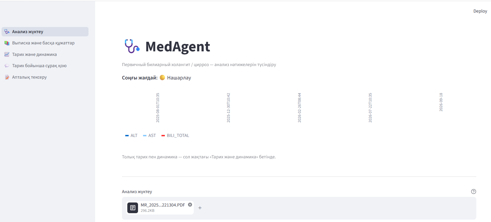
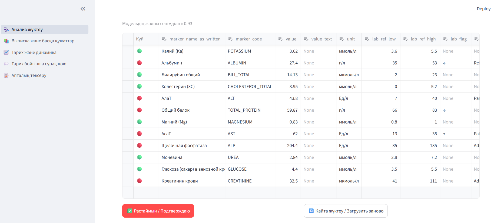
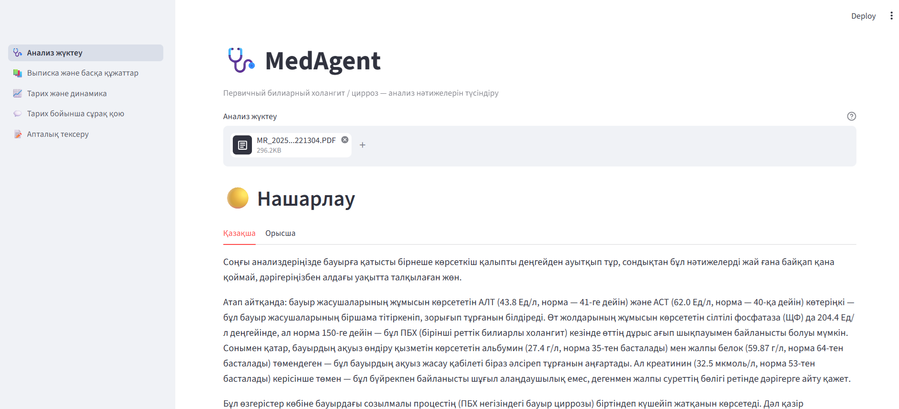
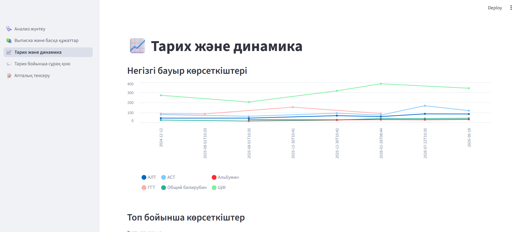
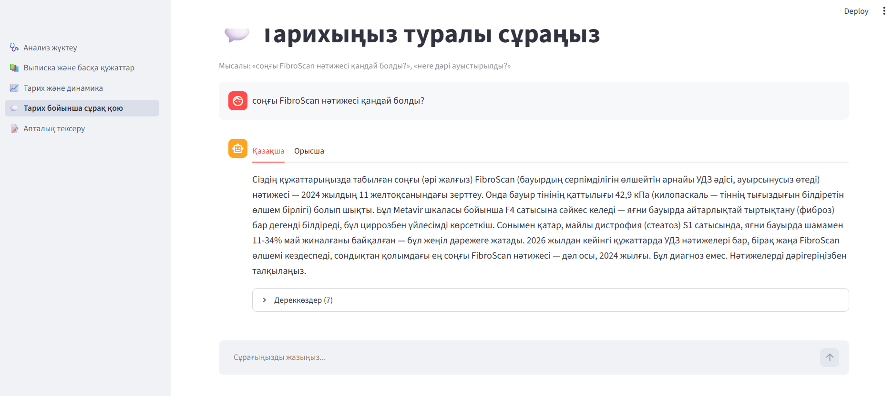
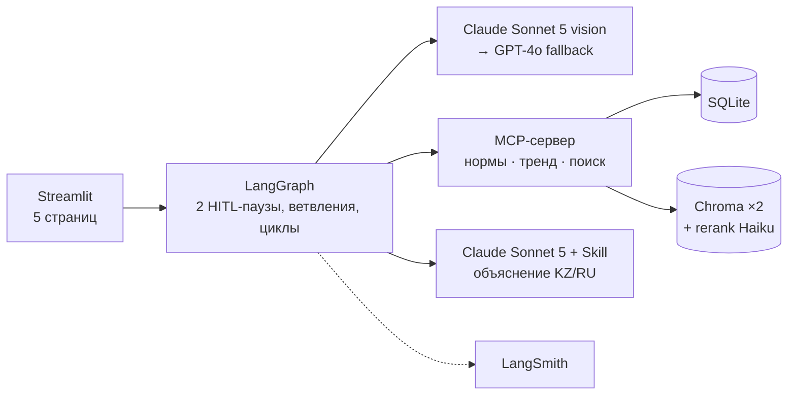

# 🩺 MedAgent

**Персональный ассистент по анализам для пациентки с первичным билиарным холангитом (ПБХ) и циррозом печени и её семьи.** Интерфейс на казахском, объяснения на казахском и русском.

> 🎬 **Демо:** показывается вживую на защите (приложение работает на реальных медицинских данных, поэтому публичный деплой не делается). Видео будет добавлено сюда.
> 📐 Архитектура: [ARCHITECTURE.md](ARCHITECTURE.md) · 📊 Evals и A/B: [EVALS.md](EVALS.md) · 🎤 Презентация защиты (PDF, на казахском): [MedAgent қорғау.pdf](MedAgent%20қорғау.pdf)

---

## Проблема

При ПБХ с циррозом анализы сдают каждые 1–3 месяца: биохимия, ОАК, коагулограмма, ОАМ, иногда 30–40 показателей за раз, на бланках разных лабораторий, на русском и казахском. Семья хочет понимать, **что изменилось, насколько это серьёзно и когда нужно к врачу**. Но бланки разрознены, нормы у лабораторий разные, а тренды никто не считает. Проект сделан для реального человека и проверялся на её реальных документах.

## Что умеет

| | Функция |
|---|---|
| 📷 | Читает **фото и PDF** анализов (в том числе многостраничные) и выписок / УЗИ / FibroScan (Claude Sonnet 5 vision → fallback GPT-4o) |
| ✅ | Показывает прочитанные значения таблицей (🔴 вне нормы / 🟢 норма) с датой регистрации, лабораторией и названием анализа. **Ничего не сохраняется без подтверждения человеком** |
| 📚 | **Несколько анализов сразу**: параллельное чтение, очередь, подтверждение по одному, «Келесі анализ →» |
| 🚦 | Уровень тяжести **по правилам, не LLM**: критический порог → «к врачу сейчас» |
| 🗣️ | Объяснение простым языком **KZ + RU** по Skill с глоссарием, с опорой на клинические руководства (RAG) и дисклеймером |
| 📈 | История и тренды по каждому маркеру, MELD-Na |
| 💬 | Вопросы по своей истории («когда был фиброскан?»): две RAG-коллекции (руководства + свои документы) + подтверждённые значения |
| 🆕 | Незнакомый маркер: LLM предлагает запись справочника, человек утверждает |
| 🔒 | Guardrails: prompt injection (RU/KZ/EN), удаление персональных данных до эмбеддинга, дедупликация по файлу и по содержанию |

## Скриншоты

| Главная: меню на казахском, последний статус, загрузка | Подтверждение значений (HITL): 🔴 вне нормы / 🟢 норма |
|---|---|
|  |  |
| **Объяснение: уровень тяжести, KZ / RU** | **История и тренды** |
|  |  |
| **Вопрос по истории (RAG по своим документам)** | |
|  | |

## Архитектура кратко



Подробно: граф узлов, путь одного запроса, обоснование решений, безопасность — в [ARCHITECTURE.md](ARCHITECTURE.md).

| Требование ТЗ | Где |
|---|---|
| MCP | `mcp_server/`: собственный сервер, 3 tool (`get_reference_ranges`, `compute_trend`, `search_knowledge`) |
| Skill | `skills/pbc-cirrhosis-explainer/`: SKILL.md, глоссарий KZ/RU, шаблоны тона; загружается только в узле объяснения |
| LangGraph: ветвления, циклы, HITL | `graph/`: 20 узлов, 2 `interrupt()`, циклы подтверждения и RAG-повтора |
| RAG | `rag/`, 2 коллекции, header-aware chunking, reranker |
| Обработка документов / мультимодальность | `ocr/`: фото + многостраничные PDF, структурированный вывод Pydantic |
| LangSmith | `llm_clients.py` + `LANGSMITH_TRACING` |
| Evals: 30 примеров, ≥ 2 метрики | `evals/`, см. [EVALS.md](EVALS.md) |
| A/B-тест, гиперпараметры | `abtest/`, см. [EVALS.md](EVALS.md) |
| Веб-фронтенд | `app/` (Streamlit) |

## Ключевые результаты

| | |
|---|---|
| Точность чтения значений с реальных бланков | **97.8%** (136/139), recall маркеров 100% |
| Точность уровня эскалации | **12/12**, 0 пропущенных критических |
| Faithfulness объяснений (судья GPT-4o) | **5.00 / 5**, упоминание отклонений 98.2% |
| Обнаружение prompt injection | **3/3** |
| Ожидание объяснения после эксперимента с `effort` | **~71 с → ~37 с** |

## Запуск

Требуется Python 3.11+ (проверено на 3.13) и ключи Anthropic и OpenAI (OpenAI используется для эмбеддингов, fallback OCR и судьи в evals).

```bash
git clone https://github.com/kassiyet-13/MedAgent.git
cd MedAgent
python -m venv .venv
.venv\Scripts\activate            # Windows;  source .venv/bin/activate — macOS/Linux
pip install -r requirements.txt

cp .env.example .env              # вписать ANTHROPIC_API_KEY, OPENAI_API_KEY, (опц.) LANGSMITH_API_KEY

python -m data.seed_db            # SQLite: справочник норм (~100 маркеров) + пациент по умолчанию
python -m rag.build_index         # Chroma: коллекция clinical_guidelines из rag/corpus/

streamlit run app/streamlit_app.py
```

Откроется http://localhost:8501. Загрузите фото или PDF анализа на странице «Анализ жүктеу».

Дополнительно:

```bash
python -m mcp_server.server       # MCP-сервер отдельно (stdio), например для MCP Inspector
pytest tests/                     # регрессионные тесты guardrails
python -m evals.run_evals         # evals (нужен локальный golden_real.json — см. EVALS.md)
```

## Структура

```
app/            Streamlit: streamlit_app.py (навигация) + pages/
graph/          LangGraph: state, nodes, edges, build_graph
mcp_server/     MCP-сервер и 3 tool; data/reference_ranges.json — справочник норм
ocr/            извлечение (vision LLM), схемы Pydantic, предложение новых маркеров
rag/            эмбеддинги, chunking, индексация, reranker, обслуживание patient_history
chat/           вопросы по истории (две коллекции + подтверждённые значения)
skills/         Skill pbc-cirrhosis-explainer + глоссарий
guardrails/     prompt-injection check, PII scrub
data/           модели SQLAlchemy, seed, дедупликация
evals/          golden dataset, метрики, прогон
abtest/         эксперимент effort, A/B Claude vs GPT-4o, LLM-судья
tests/          pytest
```

## Приватность

Проект сделан на реальных медицинских документах. **В репозитории их нет**: база, загрузки, векторное хранилище, реальная часть golden dataset и сырые результаты evals находятся в `.gitignore`. Персональные данные удаляются из текстов документов до эмбеддинга.

## Ограничения

MedAgent **не ставит диагноз** и не заменяет врача. Изображения (УЗИ, КТ) не интерпретируются, используется только текст заключения. Известные слабые места и планы описаны в [ARCHITECTURE.md §7](ARCHITECTURE.md#7-ограничения-и-планы) и [EVALS.md](EVALS.md).
